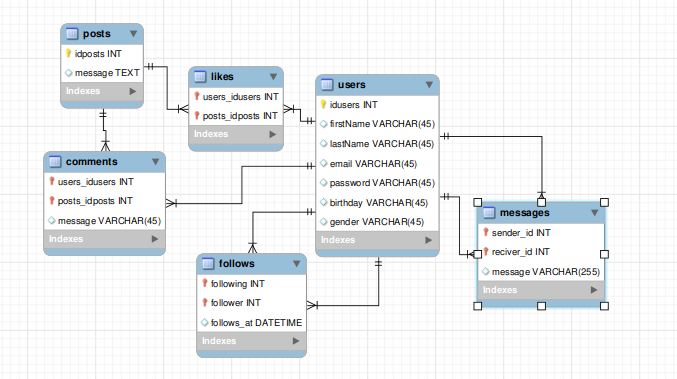
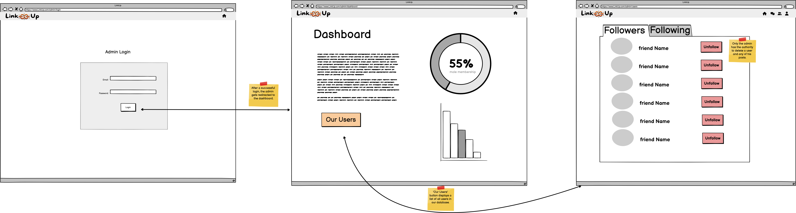

# Social Media Platform - Project Documentation

## Project Overview
*Objective:*  
The goal of this project is to develop a simple social media platform that allows users to create profiles, post updates, follow other users, and interact through likes and comments. The project focuses on building a functional MVP (Minimal Viable Product) that can be expanded in the future.

*Team Members:*
- Muath Ademar
- Mustafa Taha
- Rand Farhoud
- Randa Tawasha

*Timeframe:*  
5 Days

**Deployment Link:**  
[Live Demo](http://51.20.56.131/)

## Tech Stack
- *Frontend:* React
- *Backend:* Node.js, Express.js
- *Database:* MongoDB
- *Authentication:* JWT (JSON Web Tokens)
- *Real-Time Updates:* Socket.io
- *Styling:* Bootstrap or Material-UI, CSS/SCSS

## Demo

  

## Features
1. *User Authentication*
   - *Sign-Up:* Users can register with an email, username, and password.
   - *Log-In:* User login implemented with JWT-based authentication.
   - *Profile Management:* Users can edit their profiles, including profile pictures and bios.

2. *Post Creation and Interaction*
   - *Create Posts:* Users can create text-based posts.
   - *Like Posts:* Users can like or unlike posts.
   - *Comment on Posts:* Users can comment on posts.
   - *Edit/Delete Posts:* Users can edit or delete their posts.

3. *Follow System*
   - *Follow/Unfollow Users:* Users can follow or unfollow other users.
   - *Followers/Following List:* Users can view who they follow and who follows them.

4. *Feed*
   - *Personalized Feed:* Displays posts from users that the logged-in user follows.
   - *Explore Feed (Optional):* Shows popular or recommended posts from all users.

5. *Notifications (Optional)*
   - *Real-Time Notifications:* Notifies users when someone likes, comments on their post, or follows them.

6. *Responsive Design*
   - *Mobile-Friendly:* Ensures the platform is accessible and user-friendly on mobile devices.

## Project Workflow
*Day 1: Project Setup and Planning*
- *Frontend:*
  - Set up the React.js project structure.
  - Design the initial layout and reusable components (Header, Footer, Profile Page).
- *Backend:*
  - Set up the Express.js server.
  - Configure MongoDB and Mongoose for database modeling.
  - Implement basic user authentication (sign-up, log-in).

*Day 2: User Profiles and Posts*
- *Frontend:*
  - Develop the user profile page with profile editing capabilities.
  - Implement the post creation form.
- *Backend:*
  - Create API endpoints for creating, editing, and deleting posts.
  - Implement the follow/unfollow system.

*Day 3: Feed and Interaction Features*
- *Frontend:*
  - Build the feed display, showing posts from followed users.
  - Implement the liking and commenting system.
- *Backend:*
  - Develop endpoints for fetching posts, liking posts, and adding comments.
  - Set up the notification system for likes, comments, and follows.

*Day 4: Integration and Real-Time Features*
- *Frontend:*
  - Integrate the frontend with backend APIs.
  - Implement real-time updates using Socket.io (optional).
- *Backend:*
  - Finalize API development and ensure all endpoints work with the frontend.
- *Testing:*
  - Conduct initial testing for all features and start debugging.

*Day 5: Final Testing and Deployment*
- *Testing:*
  - Conduct thorough testing of all features across devices and browsers.
  - Fix any remaining bugs and refine the user interface.
- *Deployment:*
  - Deploy the application to a cloud platform like AWS.
- *Documentation:*
  - Prepare documentation and project summary for future expansion or demonstration.

## Future Enhancements
- *Direct Messaging:* Implement a private messaging system between users.
- *Media Uploads:* Allow users to upload images and videos in their posts.
- *Advanced Notifications:* Enhance the notification system with more detailed user actions.
- *Analytics:* Provide insights into user engagement and activity.

## ERD (Entity-Relationship Diagram)

  

## User Journey

  

## Admin Journey

  

## Conclusion
By following this plan, the team will be able to create a basic but functional social media platform in just five days. The project will offer a foundation for further development and enhancements in the future.

---

Feel free to customize the content to better fit your project specifics and team requirements.
